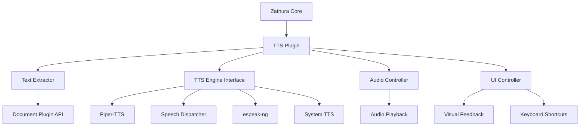

# Design Document

## Overview

The text-to-speech (TTS) reader extension for Zathura will be implemented as a separate plugin that integrates with Zathura's existing architecture. The extension will provide audio narration of PDF content by extracting text from pages and interfacing with system TTS engines. The design follows Zathura's plugin architecture and leverages existing text extraction capabilities from document plugins.

## Architecture

### High-Level Architecture



### Plugin Integration

The TTS extension will be implemented as a Zathura plugin that:
- Registers with Zathura's plugin manager during initialization
- Hooks into Zathura's keyboard shortcut system
- Accesses document content through existing APIs
- Maintains its own state without interfering with core functionality

## Components and Interfaces

### 1. TTS Plugin Core (`zathura-tts-plugin`)

**Purpose**: Main plugin entry point and coordinator

**Key Functions**:
- `tts_plugin_register()`: Register plugin with Zathura
- `tts_plugin_init()`: Initialize TTS subsystems
- `tts_plugin_cleanup()`: Clean shutdown of TTS resources

**Interface with Zathura**:
```c
typedef struct {
    zathura_plugin_functions_t functions;
    zathura_plugin_version_t version;
    char* name;
} zathura_tts_plugin_t;
```

### 2. Text Extractor (`tts-text-extractor`)

**Purpose**: Extract readable text from PDF pages

**Key Functions**:
- `tts_extract_page_text()`: Get all text from a page
- `tts_extract_text_segments()`: Break text into readable segments
- `tts_handle_special_content()`: Process formulas, tables, links

**Text Extraction Strategy**:
- Use `zathura_page_get_text()` with full page rectangle to get all text
- Parse and segment text into sentences/paragraphs
- Handle special content types (mathematical notation, tables, hyperlinks)
- Maintain reading order and structure

### 3. TTS Engine Interface (`tts-engine`)

**Purpose**: Abstract interface to various TTS engines

**Supported Engines**:
- Piper-TTS (primary choice - high-quality neural voices)
- Speech Dispatcher (fallback)
- espeak-ng (secondary fallback)
- System-specific TTS APIs

**Key Functions**:
- `tts_engine_init()`: Initialize preferred TTS engine
- `tts_engine_speak()`: Queue text for speech
- `tts_engine_pause()`: Pause/resume playback
- `tts_engine_stop()`: Stop current speech
- `tts_engine_set_voice()`: Configure voice parameters

**Engine Selection Logic**:
```c
typedef enum {
    TTS_ENGINE_PIPER,
    TTS_ENGINE_SPEECH_DISPATCHER,
    TTS_ENGINE_ESPEAK,
    TTS_ENGINE_SYSTEM,
    TTS_ENGINE_NONE
} tts_engine_type_t;
```

### 4. Audio Controller (`tts-audio-controller`)

**Purpose**: Manage audio playback state and navigation

**Key Functions**:
- `tts_audio_play_text()`: Start reading text segments
- `tts_audio_navigate()`: Skip to next/previous segment
- `tts_audio_set_speed()`: Adjust reading speed
- `tts_audio_set_volume()`: Control volume

**State Management**:
```c
typedef struct {
    bool is_playing;
    bool is_paused;
    int current_page;
    int current_segment;
    float speed_multiplier;
    int volume_level;
    char* current_text;
} tts_audio_state_t;
```

### 5. UI Controller (`tts-ui-controller`)

**Purpose**: Handle user interface integration and visual feedback

**Key Functions**:
- `tts_ui_register_shortcuts()`: Register keyboard shortcuts
- `tts_ui_show_controls()`: Display TTS control interface
- `tts_ui_highlight_text()`: Visual highlighting of spoken text
- `tts_ui_show_settings()`: TTS configuration dialog

**Keyboard Shortcuts**:
- `Ctrl+T`: Toggle TTS on/off
- `Ctrl+Space`: Pause/resume
- `Ctrl+Right`: Next sentence
- `Ctrl+Left`: Previous sentence
- `Ctrl+Shift+T`: TTS settings

### 6. Configuration Manager (`tts-config`)

**Purpose**: Handle TTS settings and preferences

**Configuration Options**:
```c
typedef struct {
    tts_engine_type_t preferred_engine;
    float default_speed;
    int default_volume;
    char* preferred_voice;
    bool auto_continue_pages;
    bool highlight_spoken_text;
    bool announce_page_numbers;
} tts_config_t;
```

## Data Models

### Text Segment Structure

```c
typedef struct {
    char* text;
    zathura_rectangle_t bounds;
    int page_number;
    int segment_id;
    tts_content_type_t type;
} tts_text_segment_t;

typedef enum {
    TTS_CONTENT_NORMAL,
    TTS_CONTENT_HEADING,
    TTS_CONTENT_FORMULA,
    TTS_CONTENT_TABLE,
    TTS_CONTENT_LINK,
    TTS_CONTENT_CAPTION
} tts_content_type_t;
```

### TTS Session State

```c
typedef struct {
    zathura_t* zathura;
    tts_audio_state_t audio_state;
    tts_config_t config;
    girara_list_t* text_segments;
    tts_engine_t* engine;
    GThread* audio_thread;
} tts_session_t;
```

## Error Handling

### Error Types

```c
typedef enum {
    TTS_ERROR_OK,
    TTS_ERROR_NO_ENGINE,
    TTS_ERROR_NO_TEXT,
    TTS_ERROR_ENGINE_FAILED,
    TTS_ERROR_INVALID_PAGE,
    TTS_ERROR_AUDIO_FAILED
} tts_error_t;
```

### Error Handling Strategy

1. **Graceful Degradation**: If TTS engine fails, show user-friendly error messages
2. **Fallback Engines**: Try alternative TTS engines if primary fails
3. **Silent Failures**: Don't break Zathura functionality if TTS fails
4. **User Notification**: Display status messages for TTS state changes

## Testing Strategy

### Unit Tests

1. **Text Extraction Tests**:
   - Test text extraction from various PDF types
   - Verify proper handling of special content
   - Test text segmentation logic

2. **TTS Engine Tests**:
   - Mock TTS engines for testing
   - Test engine selection and fallback logic
   - Verify audio state management

3. **Integration Tests**:
   - Test plugin registration with Zathura
   - Verify keyboard shortcut handling
   - Test configuration persistence

### Manual Testing

1. **Accessibility Testing**:
   - Test with screen readers
   - Verify voice quality and clarity
   - Test navigation controls

2. **Performance Testing**:
   - Test with large documents
   - Verify memory usage
   - Test audio latency

3. **Platform Testing**:
   - Test on different Linux distributions
   - Verify TTS engine compatibility
   - Test configuration persistence

### Test Documents

- Simple text PDFs
- PDFs with mathematical formulas
- PDFs with tables and figures
- Multi-language documents
- Large documents (100+ pages)

## Implementation Notes

### Threading Model

- Main TTS logic runs on Zathura's main thread
- Audio playback uses separate thread to avoid blocking UI
- Thread-safe communication using GLib's threading primitives

### Memory Management

- Use Zathura's memory management patterns (girara_list_t, g_malloc/g_free)
- Clean up TTS resources on plugin unload
- Avoid memory leaks in long-running sessions

### Platform Compatibility

- Primary target: Linux with Piper-TTS (pip install piper-tts)
- First fallback: Speech Dispatcher for system integration
- Second fallback: espeak-ng for basic TTS functionality
- Conditional compilation for platform-specific features
- Runtime detection of available TTS engines with preference order